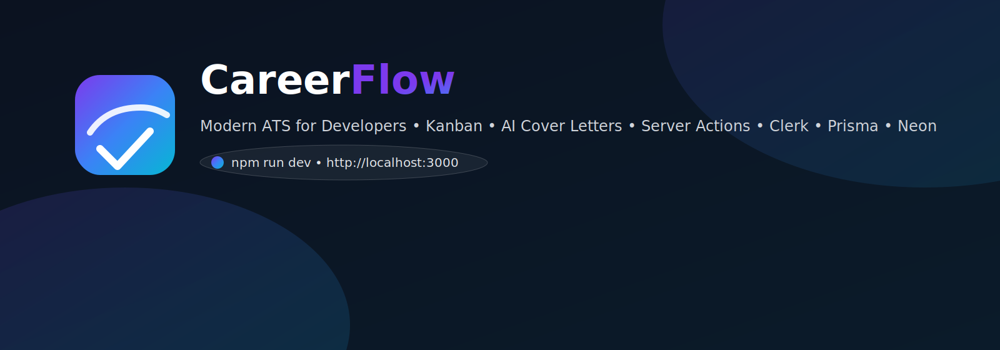
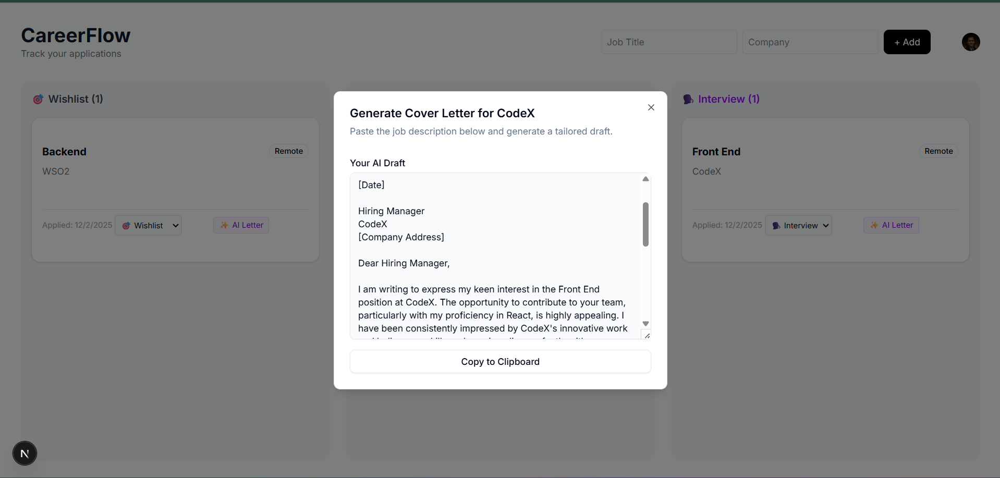

<!-- Banner -->
<p align="center">
  
</p>

<h1 align="center">CareerFlow</h1>

<!-- Primary Screenshot -->
<p align="center">
  
</p>

<p align="center">
  A modern, full-stack ATS to organize your job hunt — Kanban dashboard, AI-powered cover letters, secure auth, and blazing-fast Server Actions.
</p>

<p align="center">
  <a href="https://nextjs.org/"></a>
  <a href="https://www.typescriptlang.org/"></a>
  <a href="https://tailwindcss.com/"></a>
  <a href="https://ui.shadcn.com/"></a>
  <a href="https://www.prisma.io/"></a>
  <a href="https://neon.tech/"></a>
  <a href="https://clerk.com/"></a>
  <a href="https://ai.google.dev/"></a>
  <a href="https://vercel.com/"></a>
  <a href="./LICENSE"></a>
</p>

<p align="center">
  <a href="#-getting-started-locally">Quick Start</a> •
  <a href="#-features">Features</a> •
  <a href="#-architecture">Architecture</a> •
  <a href="#-tech-stack">Tech Stack</a> •
  <a href="#%EF%B8%8F-deployment">Deployment</a> •
  <a href="#-contributing">Contributing</a>
</p>

---

## ✨ Features

- 📋 Kanban Dashboard — Drag-and-drop columns: Wishlist, Applied, Interview, Offer
- 🔐 Secure Authentication — Clerk-powered (Google & Email)
- 🤖 AI Cover Letters — Google Gemini generates tailored letters from job descriptions
- ☁️ Cloud Database — Serverless PostgreSQL on Neon
- ⚡ Real-Time Updates — Next.js 15 Server Actions for instant mutations
- 🎨 Modern UI — Shadcn/UI + Tailwind with elegant defaults
- 🧩 Type-safe Stack — Prisma ORM with end-to-end TypeScript
- 🚀 Vercel-ready — Built for instant global deployment

---

## 🏗️ Architecture

- Frontend: Next.js 15 App Router with React Server Components
- Auth: Clerk-managed sessions and protected routes (via middleware)
- Backend: Server Actions (`actions.ts`) execute on the server to talk to the DB
- Database: Prisma -> Neon Postgres
- AI Layer: Server-side prompts to Gemini Flash model to generate text

```mermaid
flowchart LR
  A[Client (RSC/RSC+CSR)] -->|Actions| B[Next.js Server Actions]
  B --> C[Prisma ORM]
  C --> D[(Neon Postgres)]
  B --> E[Gemini Flash API]
  A --> F[Clerk Auth]
  F --> B
```

---

## 🛠️ Tech Stack

- Framework: Next.js 15 (App Router)
- Language: TypeScript
- Styling: Tailwind CSS + Shadcn/UI
- Database: PostgreSQL (Neon)
- ORM: Prisma
- Auth: Clerk
- AI: Google Gemini API
- Deployment: Vercel

---

## 🚀 Getting Started Locally

1) Clone the repository
```bash
git clone https://github.com/YOUR_USERNAME/career-flow.git
cd career-flow
```

2) Install dependencies
```bash
npm install
```

3) Environment setup  
Create a `.env` in the project root with:
```bash
# Database (Neon)
DATABASE_URL="postgresql://..."

# Auth (Clerk)
NEXT_PUBLIC_CLERK_PUBLISHABLE_KEY="pk_test_..."
CLERK_SECRET_KEY="sk_test_..."

# AI (Google)
GEMINI_API_KEY="AIza..."
```

4) Setup database
```bash
npx prisma db push
```

5) Run the app
```bash
npm run dev
```

Now visit http://localhost:3000

---

## 📦 Deployment

This project is optimized for Vercel.

- Push your code to GitHub
- Import the project into Vercel
- Add the Environment Variables (from step 3) in the Vercel dashboard
- IMPORTANT: Add the postinstall script below so Prisma generates on build
- Click Deploy

One‑click deploy (update repository URL to your fork):
  
[](https://vercel.com/new/clone?repository-url=https://github.com/YOUR_USERNAME/career-flow)

Add this to your `package.json`:
```json
{
  "scripts": {
    "postinstall": "prisma generate"
  }
}
```

---

## 🧭 Project Structure

```
career-flow/
├─ app/
│  ├─ (dashboard)/
│  ├─ api/
│  ├─ layout.tsx
│  └─ page.tsx
├─ components/
├─ lib/
│  ├─ auth/
│  ├─ ai/
│  └─ utils.ts
├─ prisma/
│  └─ schema.prisma
├─ public/
│  ├─ careerflow-mark.svg
│  ├─ careerflow-banner.svg
│  └─ screenshot.png
├─ styles/
├─ .env
├─ package.json
└─ README.md
```

---

## 🤖 AI Cover Letters

- Paste a job description
- CareerFlow creates a concise, personalized cover letter using Gemini Flash
- Edit and export to PDF or copy to clipboard

Tips:
- Provide company values and role expectations for better personalization
- Save templates for faster iteration

---

## 🔐 Authentication

- Google and Email sign-in via Clerk
- Route protection via middleware
- Server Actions receive the authenticated user for data mutations

---

## 🗃️ Database & Prisma

- Neon serverless Postgres for zero-config scalability
- Prisma for type-safe queries & migrations

Common commands:
```bash
# Update DB schema from Prisma
npx prisma db push

# Generate Prisma client
npx prisma generate

# Open the Prisma Studio
npx prisma studio
```

---

## 🧪 Scripts

```bash
# Start dev server
npm run dev

# Lint
npm run lint

# Build
npm run build

# Start production server
npm start
```

---

## 🖼️ Screenshots

Place your screenshots in `public/` and reference them here:

- Dashboard: `./public/screenshot-dashboard.png`
- AI Cover Letter: `./public/screenshot-cover-letter.png`
- General: `./public/screenshot.png`

```markdown


```

---

## 🎨 Branding & Icons

This repo includes simple SVG assets you can customize:
- `public/careerflow-mark.svg` — App icon / favicon
- `public/careerflow-banner.svg` — README & social banner

Set your app icon with Next.js App Router by adding:
```tsx
// app/icon.tsx (optional)
export default function Icon() {
  return ;
}
```

Set Open Graph image in `app/layout.tsx`:
```ts
export const metadata = {
  metadataBase: new URL("https://your-domain.com"),
  title: "CareerFlow",
  description: "A modern ATS for developers.",
  openGraph: {
    title: "CareerFlow",
    description: "A modern ATS for developers.",
    images: ["/careerflow-banner.svg"],
  },
  icons: [{ rel: "icon", url: "/careerflow-mark.svg" }],
};
```

---

## 🤝 Contributing

Contributions are welcome!

- Fork the project
- Create your feature branch: `git checkout -b feature/AmazingFeature`
- Commit your changes: `git commit -m "Add some AmazingFeature"`
- Push to the branch: `git push origin feature/AmazingFeature`
- Open a Pull Request

---

## 📄 License

Distributed under the MIT License. See [LICENSE](./LICENSE) for details.

---

## 🙌 Acknowledgments

- Next.js, Clerk, Prisma, Neon, Tailwind, shadcn/ui
- Google’s Gemini Flash for fast, high-quality text generation

If this project helps you, consider starring the repo!
